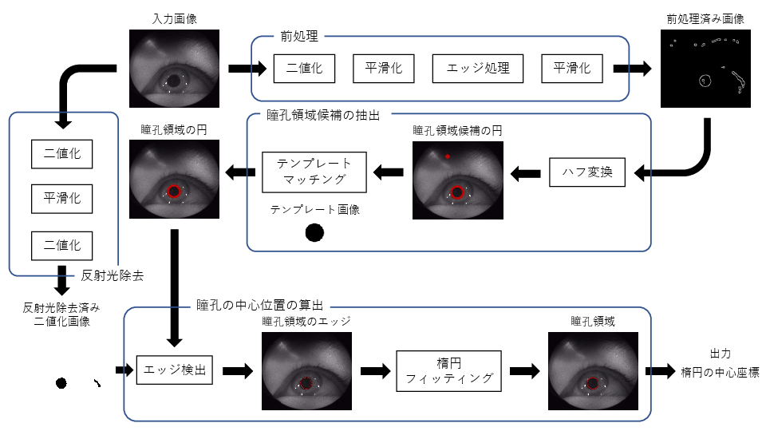

# 瞳孔検出

## 概要

ヘッドマウントディスプレイを利用した視線によるリモートカメラ制御を実現するため，目の画像から瞳孔の中心位置を検出する．

## 瞳孔検出手法

本提案手法は，

1. 入力画像の前処理
2. 瞳孔領域候補の抽出
3. 反射光除去
4. 瞳孔の中心位置の算出

から構成される．以下に各構成の詳細について述べる．

### 入力画像の前処理

目の入力画像に対して，二値化，平滑化 (1回目)，エッジ処理，平滑化 (2回目)を施す．
1. 二値化
瞳孔の色と虹彩の色の中間の値を閾値として二値化することで，瞳孔領域の色が0，それ以外の領域の色が255となる画像を生成する．

2. 平滑化 (1回目)
入力画像に対して二値化処理を施した状態では，反射光や埃，まつ毛などのノイズが瞳孔近辺に残っており，瞳孔位置算出の精度が低下する原因となる．そのため，平滑化を施すことでノイズを除去する．

3. エッジ処理
平滑化を施した二値化画像に対してエッジ処理を行い，瞳孔領域のエッジを検出する．

4. 平滑化 (2回目)
エッジ処理によって検出した瞳孔領域のエッジが必ず閉曲線になるように，2回目の平滑を行う．この処理によって後述するハフ変換による円検出の精度を向上させる．

### 瞳孔領域候補の抽出

前処理済みの入力画像に対して，ハフ変換とテンプレートマッチングを施す．ハフ変換は画像内の円検出に利用され，指定したレンジ内の半径の円を検出することができる．ハフ変換では複数の円が検出されるため，瞳孔領域に該当する円を判別するために，テンプレートマッチングを行う．テンプレート画像は事前に取得した目の画像を参考に生成した画像を利用している．

### 反射光除去

目の画像は，ヘッドマウントディスプレイ内の赤外線カメラで撮影される．その際に，赤外線の反射光が瞳孔近辺に映り込み，瞳孔検出の精度低下の原因となっていた．そこで，二値化 (1回目)，平滑化，二値化 (2回目)の3ステップで構成される反射光除去フィルタを考案した．
二値化 (1回目)と平滑化は，入力画像の前処理で前述した二値化と平滑化 (1回目)と同じ役割である．二値化 (2回目)では，平滑化画像に対して閾値を変更した二値化を施すことで，黒に囲まれた白いピクセルを除去する．これにより赤外線の反射光除去が可能となる．

### 瞳孔の中心位置の算出

反射光を除去した画像と抽出された瞳孔領域候補を入力として，瞳孔の中心位置を算出する．始めに反射光を除去した画像に対してエッジ検出を行い，検出されたエッジのうち瞳孔領域候補に該当するエッジを瞳孔のエッジとして扱う，次に，瞳孔のエッジに対して楕円フィッティンを施し，最小外接楕円の中心位置を求める．ここで円ではなく楕円であるのは，眼球が球体であるため視線方向が正面から離れた時に瞳孔が楕円になるためである．算出した最小外接楕円の中心を瞳孔の中心位置として算出する．